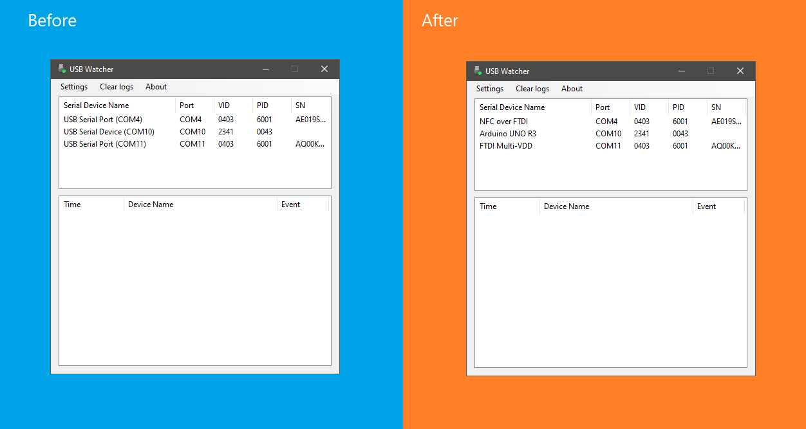

[![Contributors][contributors-shield]][contributors-url]
[![Forks][forks-shield]][forks-url]
[![Stargazers][stars-shield]][stars-url]
[![Issues][issues-shield]][issues-url]
[![MIT License][license-shield]][license-url]

<!-- PROJECT LOGO -->
 

  

<h3 align="center">USB Watcher</h3>

  

    A simple GUI tool to manage USB Serial Devices
     
    <a href="https://github.com/ExtremeGTX/USBWatcher"><strong>Explore the docs »</strong></a>
     
     
    <a href="https://github.com/ExtremeGTX/USBWatcher/issues">Report Bug</a>
    ·
    <a href="https://github.com/ExtremeGTX/USBWatcher/issues">Request Feature</a>
  

## About The Project

USB Watcher is a simple tool mainly to rename USB Serial ports on Windows

- Before vs. After

- How it looks in other Apps ([pyserial-terminal](https://pypi.org/project/pyserial/)):

## Features
- List Serial Ports
- Rename Serial Ports
- Listen to USB Insert/Remove Events
- [v1.5] **Automatically set user-defined Device names even if the device USB/COM port changed!**
- [v1.5] Highlight Device events based on Event type
- [v1.5] Show FTDI Devices serial number
- [v1.5] Auto start on User login

### Installation

  
  <a href="https://github.com/extremegtx/USBWatcher/releases/latest/" style="vertical-align: middle;">Download Latest Release</a>

## Usage

Just run `USBWatcher.exe` no installation is needed.

> [!NOTE]
> Administrator privilege needed to access devices registry paths.

## Built With

* [![.NET]][.NET-url]
* [![Visual Studio]][VS-url]
* [![Windows]][Windows-url]

## License
Distributed under the MIT License. See `LICENSE.txt` for more information.

## Contact

Mohamed ElShahawi - [@extremegtx](https://twitter.com/extremegtx)

Project Link: [https://github.com/ExtremeGTX/USBWatcher](https://github.com/ExtremeGTX/USBWatcher)

## Acknowledgments

* [Best-README-Template](https://github.com/othneildrew/Best-README-Template/)
* Project icon from [icons8](https://icons8.com/icons/set/usb)

<!-- MARKDOWN LINKS & IMAGES -->
<!-- https://www.markdownguide.org/basic-syntax/#reference-style-links -->
[contributors-shield]: https://img.shields.io/github/contributors/ExtremeGTX/USBWatcher.svg?style=for-the-badge
[contributors-url]: https://github.com/ExtremeGTX/USBWatcher/graphs/contributors
[forks-shield]: https://img.shields.io/github/forks/ExtremeGTX/USBWatcher.svg?style=for-the-badge
[forks-url]: https://github.com/ExtremeGTX/USBWatcher/network/members
[stars-shield]: https://img.shields.io/github/stars/ExtremeGTX/USBWatcher.svg?style=for-the-badge
[stars-url]: https://github.com/ExtremeGTX/USBWatcher/stargazers
[issues-shield]: https://img.shields.io/github/issues/ExtremeGTX/USBWatcher.svg?style=for-the-badge
[issues-url]: https://github.com/ExtremeGTX/USBWatcher/issues
[license-shield]: https://img.shields.io/github/license/ExtremeGTX/USBWatcher.svg?style=for-the-badge
[license-url]: https://github.com/ExtremeGTX/USBWatcher/blob/master/LICENSE.txt
[product-screenshot]: docs/USBWatcher_Screenshot.png
[VS-url]: https://visualstudio.microsoft.com/
[.NET-url]: https://dotnet.microsoft.com/en-us/download/dotnet-framework
[Windows-url]: https://www.microsoft.com/en-us/windows
[.NET]: https://img.shields.io/badge/.NET-5C2D91?style=for-the-badge&logo=.net&logoColor=white
[Visual Studio]: https://img.shields.io/badge/Visual%20Studio-5C2D91.svg?style=for-the-badge&logo=visual-studio&logoColor=white
[Windows]: https://img.shields.io/badge/Windows-0078D6?style=for-the-badge&logo=windows&logoColor=white